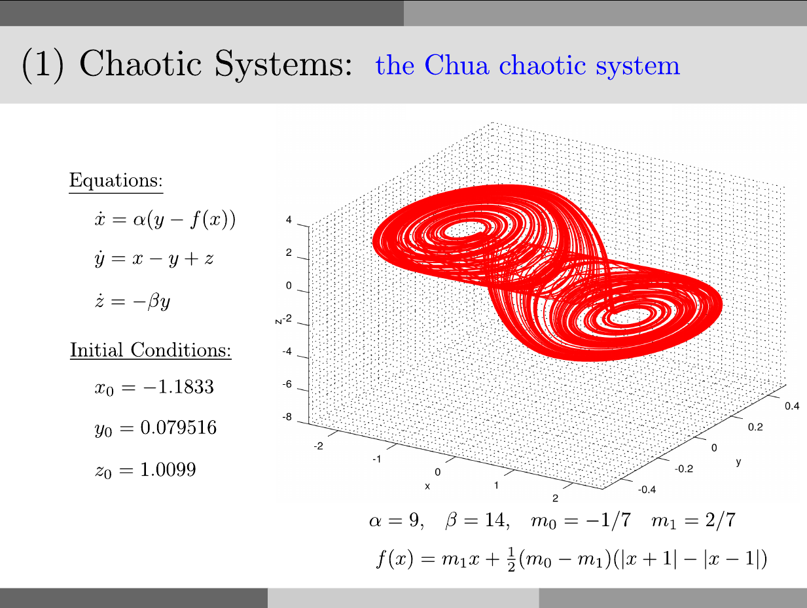

# Chua Circuit

<p style="text-align:left;"><a href="../../../notes.html"><b>NOTES</b></a> <span style="float:right;">         December 1, 2016 </span></p>

## Problem



## Solution:

in `Octave`:

```octave
close all
clear
clc

alpha = 9;
beta = 14;
m0 = -1/7;
m1 = 2/7;

F = @(x) m1*x + (1/2)*(m0-m1)*(abs(x+1)-abs(x-1));
Chua = @(t,x) [alpha*(x(2)-F(x(1)));x(1)-x(2)+x(3);-beta*x(2)];

xo = -1.1833;
yo = 0.079516;
zo = 1.0099;

N = 80000;
step_size = 0.01;
tspan = (0:N-1)*step_size;

tic
[t,xyz] =ode45(Chua,tspan,[xo,yo,zo]);
toc

x = xyz(:,1);
y = xyz(:,2);
z = xyz(:,3);

save('Chua_Octave.mat','x','y','z')
```

In `julia`:

```julia
using ODE

alpha = 9.0;
beta = 14.0;
m0 = -1.0/7.0;
m1 = 2.0/7.0;

F(x) = m1*x + (1/2)*(m0-m1)*(abs(x+1)-abs(x-1));
Chua(t,x) = [alpha*(x[2]-F(x[1]));x[1]-x[2]+x[3];-beta*x[2]];

xo = -1.1833;
yo = 0.079516;
zo = 1.0099;

N = 80000;
step_size = 0.01;
tspan = (0:N-1)*step_size;

tic()
(t,pos) = ode45(Chua,[xo,yo,zo],tspan,points=:specified)
toc()

x = map(v->v[1],pos)
y = map(v->v[2],pos)
z = map(v->v[3],pos)

using MAT

file = matopen("./matfile/Chua_Julia.mat", "w")
write(file,"x",x)
write(file,"y",y)
write(file,"z",z)
close(file)
```

in `python3`:

```python
from scipy.integrate import odeint
import numpy as np
import time as tm

alpha = 9.0
beta = 14.0
m0 = -1.0/7.0
m1 = 2.0/7.0

def F(x):
  return m1*x + (1/2)*(m0-m1)*(np.abs(x+1)-np.abs(x-1));

def Chua(x,t): 
  return [alpha*(x[1]-F(x[0])),x[0]-x[1]+x[2],-beta*x[1]]

xo = -1.1833
yo = 0.079516
zo = 1.0099

N = 80000
step_size = 0.01
t = np.arange(0.0, N*step_size, step_size)

tic = tm.time()
xyz = odeint(Chua,[xo,yo,zo],t)
toc = tm.time()

print('Elapsed time: %.4f seconds' % (toc-tic))

import scipy.io
save_to_mat = {'x':xyz[:,0],'y':xyz[:,1],'z':xyz[:,2]}
scipy.io.savemat('./matfile/Chua_Python.mat',save_to_mat)
```