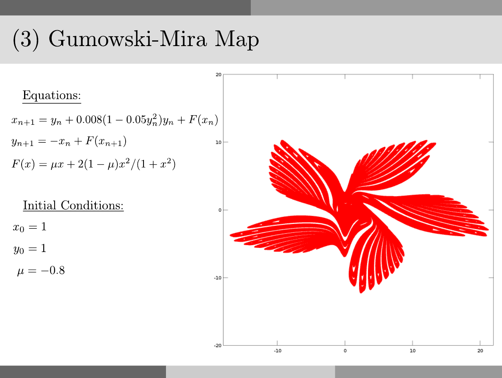

# Gumowski-Mira Map

<p style="text-align:left;"><a href="../../../notes.html"><b>NOTES</b></a> <span style="float:right;">         December 1, 2016 </span></p>

## Problem



## Solution:

in `Octave`:

```octave
close all
clear
clc

mu = -0.8;

F = @(x) mu*x + 2*(1-mu)*(x^2)/(1+x^2);
xn1 = @(xn,yn) yn + 0.008*(1-0.05*yn^2)*yn + F(xn);
yn1 = @(xn,xn1) -xn + F(xn1);

xo = 1;
yo = 1;

N = 50000;
x = zeros(1,N);
y = zeros(1,N);
x(1) = xo;
y(1) = yo;

tic
for i = 2:N
  x(i) = xn1(x(i-1),y(i-1));
  y(i) = yn1(x(i-1),x(i));
end
toc

save('Gumowski_Mira_Map_Octave.mat','x','y')
```

In `julia`:

```julia
mu = -0.8;

F(x) = mu*x + 2*(1-mu)*(x^2)/(1+x^2);
xn1(xn,yn) = yn + 0.008*(1-0.05*yn^2)*yn + F(xn);
yn1(xn,xn1) = -xn + F(xn1);

xo = 1;
yo = 1;

N = 50000;
x = zeros(N);
y = zeros(N);
x[1] = xo;
y[1] = yo;

tic()
for i = 2:N
  x[i] = xn1(x[i-1],y[i-1]);
  y[i] = yn1(x[i-1],x[i]);
end
toc()

using MAT

file = matopen("./matfile/Gumowski_Mira_Map_Julia.mat", "w")
write(file,"x",x])
write(file,"y",y])
write(file,"z",z])
close(file)
```

in `python3`:

```python
import numpy as np
import time as tm

mu = -0.8

def F(x):
  return mu*x + 2*(1-mu)*(x**2)/(1+x**2)

def xn1(xn,yn):
  return yn + 0.008*(1-0.05*yn**2)*yn + F(xn)

def yn1(xn,xn1):
  return -xn + F(xn1)

xo = 1.0
yo = 1.0

N = 50000;
x = np.zeros(N)
y = np.zeros(N)
x[0] = xo
y[0] = yo

tic = tm.time()
for i in range(1,N):
  x[i] = xn1(x[i-1],y[i-1])
  y[i] = yn1(x[i-1],x[i]) 
toc = tm.time()
print('Elapsed time: %.4f seconds' % (toc-tic))

import scipy.io
save_to_mat = {'x':x,'y':y}
scipy.io.savemat('./matfile/Gumowski_Mira_Map_Python.mat',save_to_mat)
```