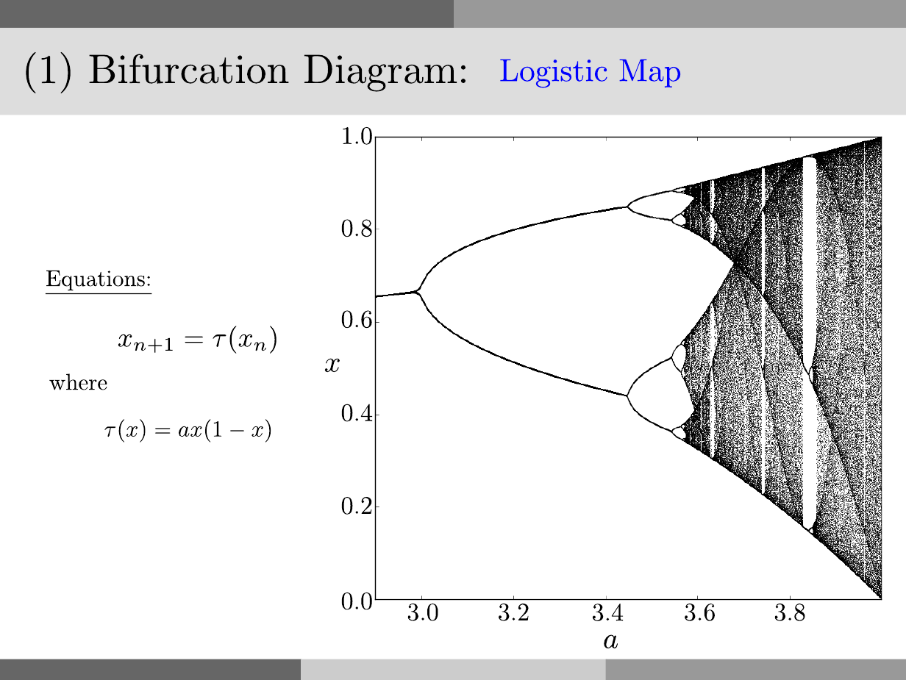

# Bifurcation Diagram: Logistic Map

<p style="text-align:left;"><a href="../../../notes.html"><b>NOTES</b></a> <span style="float:right;">         December 10, 2016 </span></p>

## Problem



## Solution:

in `Octave`:

```octave
close all
clear
clc

tau = @(a,x) a*x*(1-x);

xo = 0.6;
N = 71;
a_min = 2.899;
a_max = 3.999;
total_of_a = 7000;
a = linspace(a_min,a_max,total_of_a);

tic
no = 1;
X = zeros(1,length(a)*N);
A = zeros(1,length(a)*N);
for alpha = a
  xinit = xo;
  for i = 1:200
    xinit = tau(alpha,xinit);
  end
  X(no) = xinit;
  A(no) = alpha;
  no += 1;
  for j = 2:N
    X(no) = tau(alpha,X(no-1));
    A(no) = alpha;
    no += 1;
  end
end
toc

figure
plot(A,X,'k.','MarkerSize',0.5)
axis square
xlim([a_min a_max])
ylim([0 1])
```

In `julia`:

```julia
using PyPlot

close()

function tau(a,x)
  return a*x*(1-x);
end

function xnext(a,xo,N)
  no = 1;
  X = zeros(length(a)*N);
  A = zeros(length(a)*N);
  for alpha in a
    xinit = xo;
    for i = 1:200
      xinit = tau(alpha,xinit)
    end
    X[no] = xinit;
    A[no] = alpha;
    no += 1;   
    for j = 2:N
      X[no] = tau(alpha,X[no-1])
      A[no] = alpha;
      no += 1;
    end
  end
  return A, X
end

xo = 0.6;
Num = 71;
a_min = 2.899;
a_max = 3.999;
total_of_a = 7000;
a = collect(a_min:(a_max-a_min)/(total_of_a-1):a_max);

tic()
A, X = xnext(a,xo,Num);
toc()

figure()
plot(A,X,".",markersize=0.5,color="black")
axis("square")
xlim(a_min,a_max)
ylim(0,1)
```

in `python3`:

```python
import matplotlib.pyplot as plt
import numpy as np
import time as tm

plt.close()

def tau(a,x):
  return a*x*(1-x)

def xnext(a,xo,N):
  no = 0
  X = np.zeros(a.size*N)
  A = np.zeros(a.size*N)
  for alpha in a:
    xinit = xo
    for i in range(200):
      xinit = tau(alpha,xinit)
    X[no] = xinit
    A[no] = alpha
    no += 1
    for j in range(1,N):
      X[no] = tau(alpha,X[no-1])
      A[no]= alpha
      no += 1
  return A, X

xo = 0.6
Num = 71
a_min = 2.899
a_max = 3.999
total_of_a = 7000
a = np.linspace(a_min,a_max,total_of_a)

tic = tm.time()
A, X = xnext(a,xo,Num)
toc = tm.time()
print('elapsed time: %.4f seconds' % (toc-tic))

fig = plt.figure()
plt.plot(A,X,".",markersize=0.5,color="black")
plt.xlim(a_min,a_max)
plt.ylim(0,1)
plt.gca().set_aspect('equal', adjustable='box')
plt.show()
```