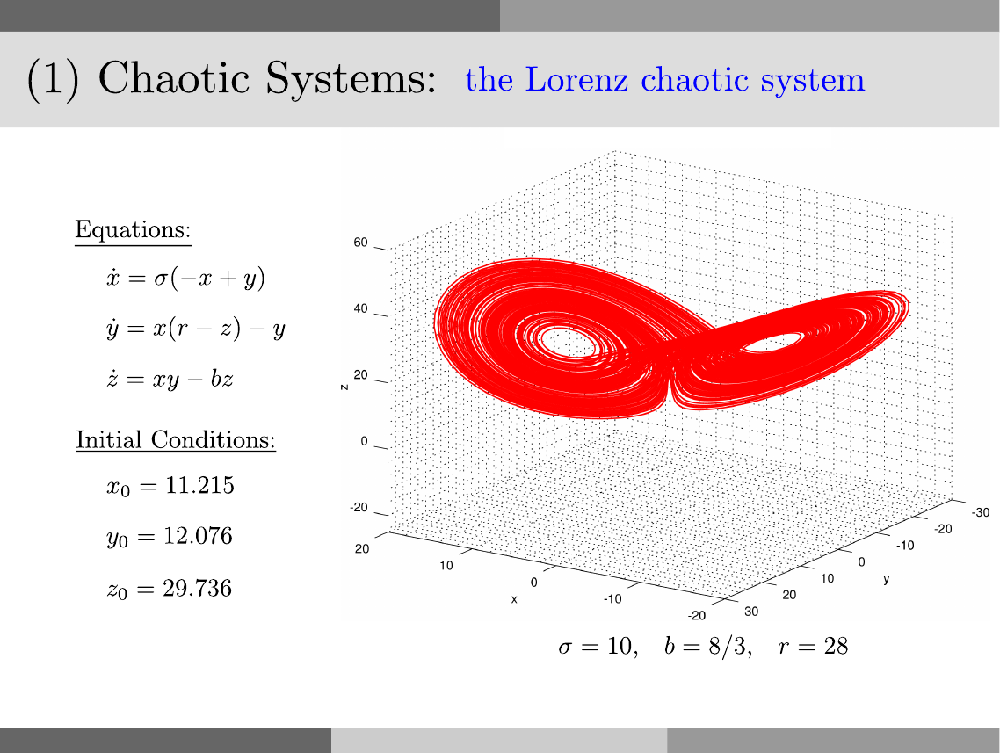

# Lorenz Attractor

<p style="text-align:left;"><a href="../../../notes.html"><b>NOTES</b></a> <span style="float:right;">         December 1, 2016 </span></p>

## Problem



## Solution:

in `Octave`:

```octave
close all
clear
clc

sigma = 10;
b = 8/3;
r = 28;

Lorenz = @(t,x) [sigma*(-x(1)+x(2)); x(1)*(r-x(3))-x(2); x(1)*x(2)-b*x(3)];

xo = 11.215;
yo = 12.076;
zo = 29.736;

N = 20000;
step_size = 0.01;
tspan = (0:N-1)*step_size;

tic
[t,xyz] =ode45(Lorenz,tspan,[xo,yo,zo]);
toc

x = xyz(:,1);
y = xyz(:,2);
z = xyz(:,3);

save('Lorenz_Octave.mat','x','y','z')
```

In `julia`:

```julia
using ODE

sigma = 10.0;
b = 8.0/3.0;
r = 28.0;

Lorenz(t,x) = [sigma*(-x[1]+x[2]); x[1]*(r-x[3])-x[2]; x[1]*x[2]-b*x[3]];

xo = 11.215;
yo = 12.076;
zo = 29.736;

N = 20000;
step_size = 0.01;
tspan = (0:N-1)*step_size;

tic()
(t,pos) = ode45(Lorenz,[xo,yo,zo],tspan,points=:specified)
toc()

x = map(v->v[1],pos)
y = map(v->v[2],pos)
z = map(v->v[3],pos)

using MAT

file = matopen("Lorenz_Julia.mat", "w")
write(file,"x",x)
write(file,"y",y)
write(file,"z",z)
close(file)
```

in `python3`:

```python
from scipy.integrate import odeint
import numpy as np
import time as tm

sigma = 10.0
b = 8.0/3.0
r = 28.0

def Lorenz(x,t): 
  return [sigma*(-x[0]+x[1]),x[0]*(r-x[2])-x[1],x[0]*x[1]-b*x[2]]

xo = 11.215
yo = 12.076
zo = 29.736

N = 20000
step_size = 0.01
t = np.arange(0.0, N*step_size, step_size)

tic = tm.time()
xyz = odeint(Lorenz,[xo,yo,zo],t)
toc = tm.time()

print('Elapsed time: %.4f seconds' % (toc-tic))

import scipy.io
save_to_mat = {'x':xyz[:,0],'y':xyz[:,1],'z':xyz[:,2]}
scipy.io.savemat('Lorenz_Python.mat',save_to_mat)
```