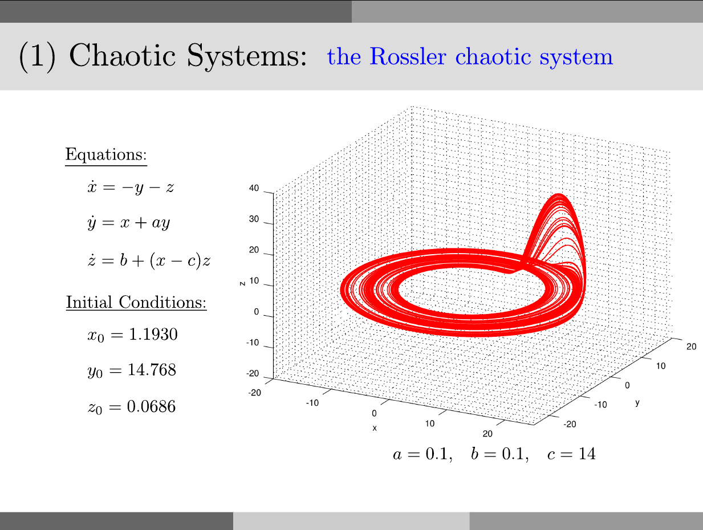

# Rossler Attractor

<p style="text-align:left;"><a href="../../../notes.html"><b>NOTES</b></a> <span style="float:right;">         December 1, 2016 </span></p>

## Problem



## Solution:

in `Octave`:

```octave
close all
clear
clc

a = 0.1;
b = 0.1;
c = 14;

Rossler = @(t,x) [-x(2)-x(3); x(1)+a*x(2); b+(x(1)-c)*x(3)];

xo = 1.1930;
yo = 14.768;
zo = 0.0686;

N = 50000;
step_size = 0.01;
tspan = (0:N-1)*step_size;

tic
[t,xyz] =ode45(Rossler,tspan,[xo,yo,zo]);
toc

x = xyz(:,1);
y = xyz(:,2);
z = xyz(:,3);

save('Rossler_Octave.mat','x','y','z')
```

In `julia`:

```julia
using ODE

a = 0.1;
b = 0.1;
c = 14;

Rossler(t,x) = [-x[2]-x[3]; x[1]+a*x[2]; b+(x[1]-c)*x[3]];

xo = 1.1930;
yo = 14.768;
zo = 0.0686;

N = 50000;
step_size = 0.01;
tspan = (0:N-1)*step_size;

tic()
(t,pos) = ode45(Rossler,[xo,yo,zo],tspan,points=:specified)
toc()

x = map(v->v[1],pos)
y = map(v->v[2],pos)
z = map(v->v[3],pos)

using MAT

file = matopen("Rossler_Julia.mat", "w")
write(file,"x",x)
write(file,"y",y)
write(file,"z",z)
close(file)
```

in `python3`:

```python
from scipy.integrate import odeint
import numpy as np
import time as tm

a = 0.1
b = 0.1
c = 14.0

def Rossler(x,t): 
  return [-x[1]-x[2], x[0]+a*x[1], b+(x[0]-c)*x[2]];

xo = 1.1930
yo = 14.768
zo = 0.0686

N = 50000
step_size = 0.01
t = np.arange(0.0, N*step_size, step_size)

tic = tm.time()
xyz = odeint(Rossler,[xo,yo,zo],t)
toc = tm.time()

print('Elapsed time: %.4f seconds' % (toc-tic))

import scipy.io
save_to_mat = {'x':xyz[:,0],'y':xyz[:,1],'z':xyz[:,2]}
scipy.io.savemat('Rossler_Python.mat',save_to_mat)
```